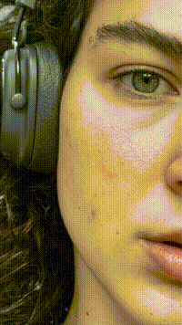
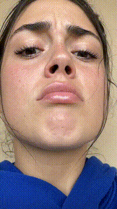

# Omni UGC Ad Factory

A Claude Code skill that turns a product and an actor reference photo into a finished
**~20-second UGC talking-head ad**: two chained 10-second Gemini Omni clips that play as one
unbroken take, shipped as a single seamless 9:16 MP4. Built on the
[MaxFusion](https://maxfusion.ai) MCP.

Real outputs of this pipeline (click a preview for the full MP4 with sound):

| | | |
|:---:|:---:|:---:|
| [](examples/final_916_gym.mp4) | [](examples/final_916_room.mp4) | [](examples/final_916_room_alt.mp4) |

## Why it exists

Anyone can prompt a talking head. The hard parts are everything that makes viewers believe
it: an actor that looks captured rather than rendered, a script that sounds like a person
and not an ad, a voice that isn't monotone, micro-behaviors (uneven pauses, a gaze drop, a
nose exhale) that land on the right beats, and two clips that join without a visible seam.

This skill encodes all of that as **machine-enforced gates**, not prose advice:

```
casting.json  ->  gate_casting.py  ->  approved_casting.txt  ->  gpt-image-2
clip1.json    ->  gate_omni.py     ->  approved_clip1.txt    ->  gemini-omni-flash
clip2.json    ->  gate_omni.py     ->  approved_clip2.txt    ->  gemini-omni-flash
```

The agent never hand-writes a generation prompt. It writes structured JSON; the gate
validates it against data-file glossaries (age-correct skin physiology, a 32-entry
micro-behavior glossary keyed to internal states, a six-category voice spec, a camera
color-grading vocabulary) and *assembles* the prompt itself on PASS. A prompt that skipped
its gate does not exist.

## The chaining trick

Omni holds its reference image for the first frames of a clip before dissolving into the
generated scene. Seed clip 2 with clip 1's trimmed final frame and that quirk becomes an
invisible join — measured seams of ~3/255 against a hard gate of 5/255. `scripts/adkit.py`
measures speech, trims dead air in the right order, verifies the seam, and stitches the
deliverable.

## Install

Drop the `omni-ugc-ad-factory/` folder into your Claude Code skills directory
(`~/.claude/skills/` or a project's `.claude/skills/`). Requirements:

- Claude Code with the MaxFusion MCP connected
- `ffmpeg` on PATH, Python 3 with `numpy` and `Pillow` (for `adkit.py`)

Then ask for an ad: *"make me a UGC ad for <product>"*. The skill asks five things once
(actor age bracket, delivery tone, visual lane, research leads, an actor reference photo)
and runs the whole pipeline: competitor teardown, gated script, gated casting, two chained
clips, seam check, stitched 9:16.

## Layout

- `SKILL.md` — the pipeline, step by step, with every production failure baked in
- `data/` — the four glossaries the gates enforce (edit these to improve the system)
- `scripts/` — `gate_casting.py`, `gate_omni.py`, `adkit.py`
- `references/` — deep references: pitfalls, Omni beat-prompting, casting realism +
  age-texture decoupling, delivery (how a real person talks), humanizer
- `examples/` — finished 9:16 ads produced by this pipeline

## Credits

- `references/humanizer.md` is [blader/humanizer](https://github.com/blader/humanizer)
  (MIT, by Siqi Chen), applied here to ad scripts.
- Video generation, image generation, ad research, and canvas analysis run on the
  [MaxFusion](https://maxfusion.ai) platform via MCP.

MIT licensed.
